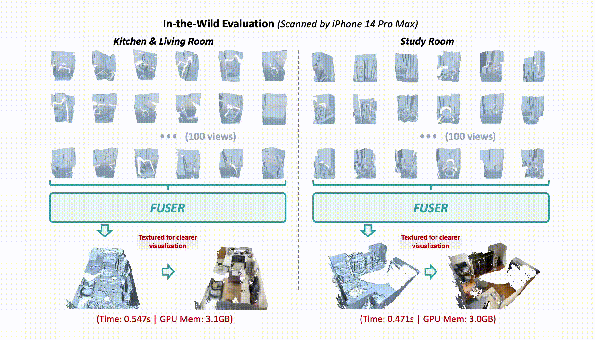

<h1 align="center"> <em>FUSER</em>: Feed-Forward Multiview 3D Registration Transformer and SE(3)<sup>N</sup> Diffusion Refinement</h1>

<div align="center">
    <p>
        <a href="https://scholar.google.com/citations?hl=zh-CN&user=xRN1zIEAAAAJ">Haobo Jiang</a><sup>1</sup>&nbsp;&nbsp;
        <a href="https://scholar.google.com/citations?user=Q7QqJPEAAAAJ&hl=zh-CN">Jin Xie</a><sup>3</sup>&nbsp;&nbsp;
        <a href="https://scholar.google.com/citations?user=6CIDtZQAAAAJ&hl=zh-CN">Jian Yang</a><sup>3</sup>&nbsp;&nbsp;
        <a href="https://openreview.net/profile?id=%7ELiang_Yu4">Liang Yu</a><sup>2</sup>&nbsp;&nbsp;
        <a href="https://scholar.google.com/citations?user=sGCf2k0AAAAJ&hl=zh-CN&oi=sra">Jianmin Zheng</a><sup>1</sup>
        <br>
    </p>
    <p>
        <sup>1</sup>Nanyang Technological University &nbsp;&nbsp;&nbsp;
        <sup>2</sup>Alibaba Group &nbsp;&nbsp;&nbsp;
        <sup>3</sup>PCA Lab, Nanjing University
    </p>
</div>

<p align="center">
    <a href="https://arxiv.org/pdf/2512.09373" target="_blank">
    
    </a>
    <a href="https://github.com/Jiang-HB/FUSER" target="_blank">
    
    </a>
    <a href="https://github.com/Jiang-HB/FUSER" target="_blank">
    
    </a>
</p>

<div align="center">
    <a href="[PROJECT_PAGE_LINK_HERE]">
        
    </a>
    <p>
        <i>Moving beyond the conventional “pairwise-then-global” paradigm, FUSER and its diffusion variant, FUSER-DF, achieve state-of-the-art performance with a dramatic runtime reduction from minutes to seconds.</i>
    </p>
</div>

## 📣 Updates


[//]: # (* **[April 18, 2026]** 📈 Benchmark code and datasets for reproducing our multiview pose estimation results on ScanNet, 3DMatch, and ARKitScenes are now available. See the [`benchmarks`]&#40;https://github.com/Jiang-HB/FUSER&#41; branch for details.)

[//]: # ()
[//]: # (* **[April 18, 2026]** 🚀 Inference code and checkpoints for both FUSER and FUSER-DF are now available!)

* **[May 3, 2026]** 📈 Benchmark code and datasets for reproducing our multiview pose estimation results on ScanNet, 3DMatch, and ARKitScenes are now available. See the [`benchmarks`](https://github.com/Jiang-HB/FUSER) branch for details.
* **[May 3, 2026]** 🚀 Inference code and checkpoints for both FUSER and FUSER-DF are now available!
* **[April 9, 2026]** ⭐ FUSER has been accepted at **CVPR 2026** as an **oral presentation**!


## ✨ Overview

**FUSER** is a feed-forward transformer for multiview point cloud registration that directly consumes 3D point cloud scans and predicts globally consistent camera poses across all scans. Departing from the conventional “pairwise registration + global synchronization” paradigm, FUSER jointly reasons over all scans in a compact latent space and regresses global poses in a single forward pass, reducing runtime from minutes to seconds while delivering state-of-the-art registration accuracy.

Built on top of FUSER, **FUSER-DF** further introduces an **SE(3)<sup>N</sup> diffusion-based refinement** process. Starting from FUSER-predicted pose priors and leveraging FUSER as a surrogate multiview registration model, it progressively denoises the poses for more accurate multiview registration.

<div align="center">
    <a href="[PROJECT_PAGE_LINK_HERE]">
        
    </a>
</div>

<div align="center">
<table>
<tr>
<td align="center" width="75%">

<br>
<!-- <em>Feed-forward multiview pose prediction by FUSER.</em> -->
</td>
<td align="center" width="25%">

<br>
<!-- <em>SE(3)<sup>N</sup> diffusion refinement by FUSER-DF.</em> -->
</td>
</tr>
</table>
</div>

## 🚀 Quick Start

### 1. Clone & Install Dependencies

First, please clone the repository to the local machine and install the required dependencies.
```bash
git clone https://github.com/Jiang-HB/FUSER.git
cd FUSER
pip install -r requirements.txt
```

### 2. Run Inference from Command Line

Try our example inference script. It can be run on a directory containing point cloud (.ply) files.

Please download the model checkpoints for [FUSER](https://drive.google.com/file/d/1sge3A0AxRmrlMIjlvDYUdICrUPstWwBU/view?usp=sharing) and [FUSER_DF](https://drive.google.com/file/d/1AnuOv518-S1uMX7LVxDt4euUAdjaSQdu/view?usp=sharing), and save them to [`ckpts`](https://github.com/Jiang-HB/FUSER/ckpts) folder.

```bash
python demo.py --data_path <path/to/data> --model_name FUSER
python demo.py --data_path <path/to/data> --model_name FUSER_DF
```

### 3\. Run with Gradio Demo

You can also launch a local Gradio demo for an interactive experience.

```bash
pip install -r requirements_demo.txt
python demo_gradio.py
```

## 📈 Benchmark Evaluation

### 1. Data Preparation

Please download the benchmark datasets of [ScanNet, 3DMatchFrame, and ArkitScenes](https://drive.google.com/file/d/1PAQuVtldMtph3A8QYZXzKeOKuY9tc9fY/view?usp=sharing), and place them in [`benchmarks/datasets/data`](https://github.com/Jiang-HB/FUSER/benchmarks/datasets/data) folder.

### 2. Run Evaluation
```bash
cd benchmarks

# Evaluate FUSER on ScanNet, 3DMatchFrame, ArkitScenes benchmarks
python run_benchmark.py --model_name FUSER --benchmark_name ScanNet --fuser_checkpoint ../ckpts/fuser.safetensors
python run_benchmark.py --model_name FUSER --benchmark_name 3DMatchFrame --fuser_checkpoint ../ckpts/fuser.safetensors
python run_benchmark.py --model_name FUSER --benchmark_name ArkitScenes --fuser_checkpoint ../ckpts/fuser.safetensors

# Evaluate FUSER-DF on ScanNet, 3DMatchFrame, ArkitScenes benchmarks
python run_benchmark.py --model_name FUSER_DF --benchmark_name ScanNet --prior_checkpoint ../ckpts/fuser.safetensors --surrogate_checkpoint ../ckpts/fuser_df.safetensors
python run_benchmark.py --model_name FUSER_DF --benchmark_name 3DMatchFrame --prior_checkpoint ../ckpts/fuser.safetensors --surrogate_checkpoint ../ckpts/fuser_df.safetensors
python run_benchmark.py --model_name FUSER_DF --benchmark_name ArkitScenes --prior_checkpoint ../ckpts/fuser.safetensors --surrogate_checkpoint ../ckpts/fuser_df.safetensors
```


## 📄 License

This project adopts a dual-licensing strategy:

| Component | License | Commercial Use |
| --- | --- | --- |
| Source code in this repository, except files that carry their own third-party license notices | [BSD 3-Clause](LICENSE) | Permitted |
| Pretrained model weights and checkpoints for FUSER / FUSER-DF | [CC BY-NC 4.0](https://creativecommons.org/licenses/by-nc/4.0/) | Not permitted |

Notes:
- The source code license does not apply to pretrained weights or checkpoints.
- Some third-party source files in this repository retain their original license headers and are not relicensed by this repository.

## 📜 Citation

If you find this repository useful, please cite:

```bibtex
@article{jiang2025fuser,
  title={FUSER: Feed-Forward MUltiview 3D Registration Transformer and SE(3)$^N$ Diffusion Refinement},
  author={Jiang, Haobo and Xie, Jin and Yang, Jian and Yu, Liang and Zheng, Jianmin},
  journal={arXiv preprint arXiv:2512.09373},
  year={2025}
}
```

## 🙏 Acknowledgements

This project builds on the broader 3D vision ecosystem, particularly sparse 3D convolutional learning and transformer-based multiview reasoning. We sincerely thank the authors of the following works:
  * [MinkowskiEngine](https://github.com/NVIDIA/MinkowskiEngine)
  * [Pi3](https://github.com/yyfz/Pi3)
  * [VGGT](https://github.com/facebookresearch/vggt)

If you have any questions or run into any issues, feel free to open an issue or reach out to me at **haobo.jiang@ntu.edu.sg**.
